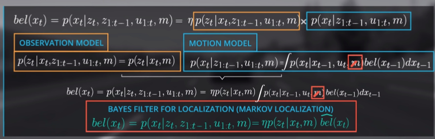
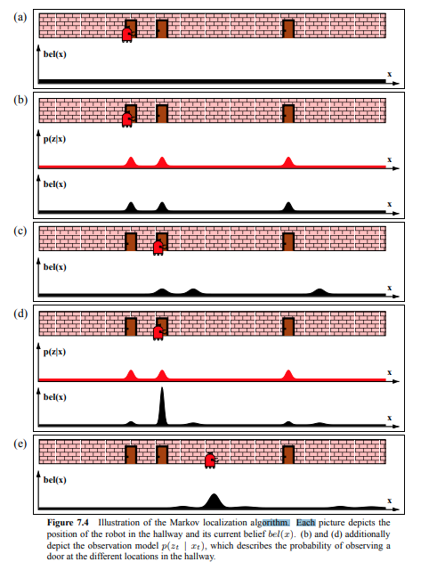
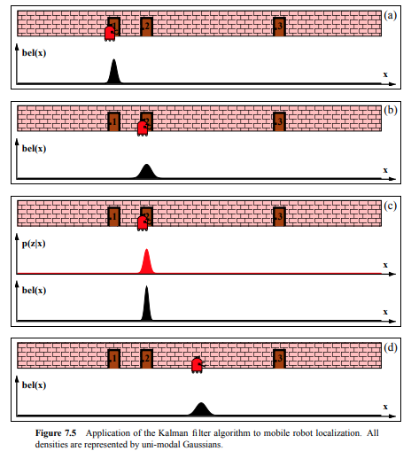
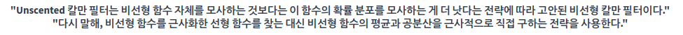
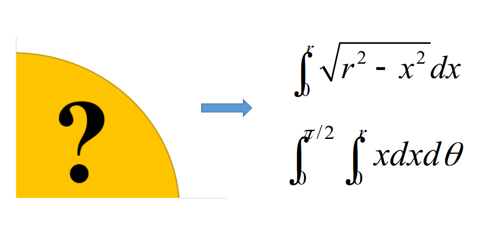
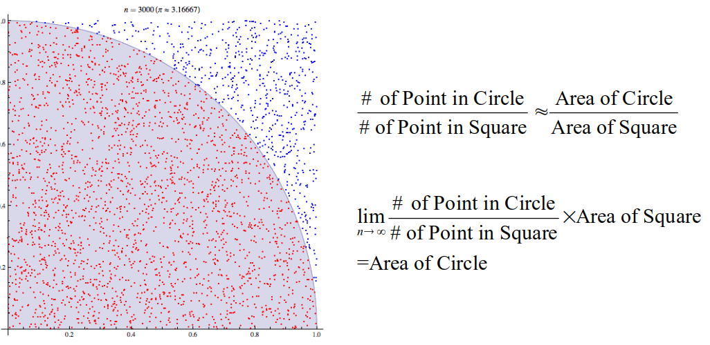
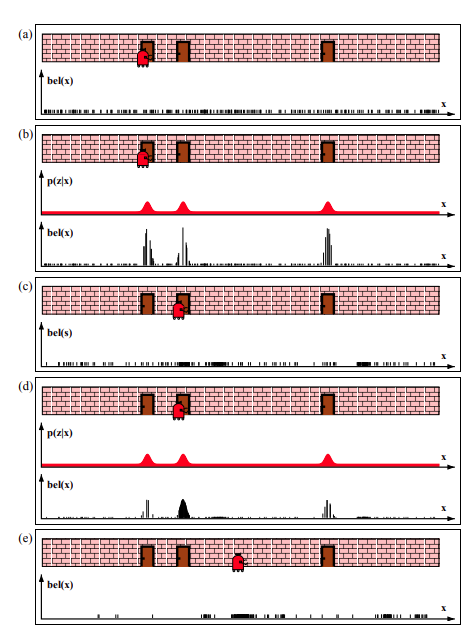
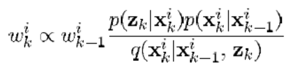
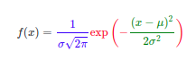

# Probabilistic Filter
- Sungwook LEE(joker1251@naver.com)
    - ALL Authority to `Sungwook LEE`
    - 모든 소스 코드는 `c++`로 직접 작성함

## Pre requirements
- Install Eigen3
    - C++에서 Matrix 연산(`dot, product, eigen, SVD...`)을 쉽게 할 수 있도록 도와주는 오픈소스 라이브러리
    - ubuntu20.04: `sudo apt install libeigen3-dev`
        - 윈도우용도 있으니, 참고하여 설치
    - 설치 확인: `dpkg -L libeigen3-dev`
    - header: `#include "Eigen/Dense"`
    - compile flag: `g++ $(pkg-config --cflags eigen3) file.cpp`

## Reference
- `Beyond the kalman filter particle filters for tracking applications` by M.S.Arulampalam
    - `A tutorial on particle filters for online nonlinear/non-Gaussian Bayesian tracking` by M.S.Arulampalam
- `Probabilistic Robotics` by S.Thrun
    - [book](https://docs.ufpr.br/~danielsantos/ProbabilisticRobotics.pdf)
- `Particle Filters` by P.Abbeel 
    - [pdf](https://homes.cs.washington.edu/~todorov/courses/cseP590/16_ParticleFilter.pdf)
- Blog
    - [Kalman Essential](http://sungwookle.github.io/research/2109121010/)
    - [EKF](http://sungwookle.github.io/research/2109151010/)
    - [UKF](http://sungwookle.github.io/research/2109181010/)
    - [Particle Essential](http://sungwookle.github.io/research/2110051010/), [Particle Filter](http://sungwookle.github.io/research/2110071010/)
- Materials
    - [01.확률이론](./1_lectureMaterials/01.%ED%99%95%EB%A5%A0%EC%9D%B4%EB%A1%A0.pptx)
    - [02.베이스필터](./1_lectureMaterials/02.%EB%B2%A0%EC%9D%B4%EC%8A%A4%ED%95%84%ED%84%B0.pptx)
    - [03.칼만필터](./1_lectureMaterials/03.%EC%B9%BC%EB%A7%8C%ED%95%84%ED%84%B0.pptx)
    - [04.비선형칼만필터](./1_lectureMaterials/04.%EB%B9%84%EC%84%A0%ED%98%95%EC%B9%BC%EB%A7%8C%ED%95%84%ED%84%B0.pptx)
    - [05.파티클필터](./1_lectureMaterials/05.%ED%8C%8C%ED%8B%B0%ED%81%B4%ED%95%84%ED%84%B0.pptx)

## Before Reading...,
- 아래의 수식은 Bayes Filter의 수식으로, Bayes Filter는 Bayes Rule 에 Marcov Process를 결합하여 Recursive하게 풀어낸 것이다.
- Bayes Filter, Kalman Filter, Non-linear Kalman, Particle Filter 는 모두 아래의 수식을 바탕으로 전개되었다. 하여서, 아래 수식을 손으로도 써보며 반드시, 제대로 느끼는 것(?)이 중요하다.
- Modern Filter Theory의 모든 것이 Bayes Rule에서 부터 시작된다.
- 

## 1. Bayes

1. In the beginning ...
    - Total Probability Theorem 
        - 
    - Conditional Probability (Likelihood)
        - 
    - Bayes Rule
        - 

2. Bayes Filter (수식 매우 중요)
    - Bayes Rule에 `Marcov Process` + `Recursive` 을 부여하여 `Belief`를 Recursively Update!
    - 
    - 

3. ILLUSTRAION OF MARKOV
    - 

4. Lecture Practice
    - [robotBayesNoInput.cpp](./2_lecturePractice/1_bayesFilter/robotBayesNoInput.cpp)
    - [robotBayesWithInput.cpp](./2_lecturePractice/1_bayesFilter/robotBayesWithInput.cpp)

5. Naive Bayes Filter Review
    - 

    - 베이즈 필터, 칼만 필터, 파티클 필터의 입력에 의한 predict, 관측에 의한 update 단계에서의 `bel=covariance`는 정확히 위의 그림과 같이 움직인다.
    - 예측 단계에서는 covariance가 움직이고(`+더하기` 불확실성 증대), update 단계에서는 covariance가 보정된다.(`x곱하기, 확률은 1보다 작은값이어서 곱하면 작아진다.` 불확실성 감쇄)

## 2. Kalman
- Bayes 필터는, 모든 state에 대한 확률 적분값(Total Probability Theorem)을 구하는 것이 현실적으로 불가능하다.
    - 칼만필터 등장의 이유
- 이를 실현 가능한 표현형으로 풀어낸 것이 칼만필터이다. 확률분포함수를 가우시안 확률분포로 하여 분포를 평균과 분산으로만 나타내어 식을 유도하였다.
- 모델의 분산과, 센서값의 분산, 이 둘을 이용해서 new_X를 만들어 내는 과정이 칼만필터
    - 

1. Assumption: Linear Model, Noise is follow Gaussian
    - Linear여야지만, 칼만 필터의 Equation을 유도할 수 있고 (예를 들어, `A'PA+Q`) 가우시안 이여야지만 확률분포를 임의의 함수가 아닌, 평균과 분산으로만 기술할 수 있게 된다.

2. Derivation
    - 
    - 

3. ILLUSTRAION OF KALMAN
    - 

4. Lecture Practice
    - [kalmanLinearX.cpp](./2_lecturePractice/2_kalmanFilter/kalmanLinearX.cpp)
    - [kalmanLinearXY.cpp](./2_lecturePractice/2_kalmanFilter/kalmanLinearXY.cpp)

## 3. Nonlinear Kalman

1. Extended Kalman Filter
    - 선형화(Jacobian)을 통한 [Covariance, State] Linear Expansion

2. Defivation
    - 
    - 
    - 

3. Lecture Practice(EFK)
    - [extendedKalmanRadar.cpp](./2_lecturePractice/3_extendedKalmanFilter/extendedKalmanRadar.cpp)
    - [extendedKalmanBenchmark.cpp](./2_lecturePractice/3_extendedKalmanFilter/extendedKalmanBenchmark.cpp)

4. Unscented Kalman Filter
    - 비선형성이 크면 클수록, EKF의 성능은 저하된다.
    - 
    - `Sigma Points`인 (1+2N)개 포인트 만으로도 로 가우시안을 평가할 수 있다. `Unscented Transform`
        - N은 State의 개수를 의미함
        - 
    - 점들은 어떻게 고를까?
        - Unscented Transform 에 정의대로 1+2N개를 고른다.
        - 
    - 
    - 

5. Lecture Practice(UKF)
    - [unscentedKalmanRadar.cpp](./2_lecturePractice/4_unscentedKalmanFilter/unscentedKalmanRadar.cpp)

6. 비선형 칼만 한계
    - 가우시안 노이즈를 따르지 않는 문제에서, 어떻게든 선형화(Extended), 선형평가(Unscented) 방식으로는 필터의 성능은 나오지 않는다.
    - 비선형을 무조건 선형화(Relaxation)할 수 있는 것이 아니다.
    - 베이즈 필터는 적분에 한계가 있었기 때문에.., 가우시안 분포를 가져와 칼만필터를 만든 것
        - 칼만필터: `Parameteric Approach`: N(0, Sigma^2)
    - 다른식의 접근법: `Non Parameteric Approach`: 가우시안 함수 등을 사용하지 말고 적분해야 하는 샘플의 개수를 유한개(몬테카를로 Sampling)로 하여 적분값을 평가하자
        - 파티클필터 등장의 이유

## 4. Particle Filter
1. 확률필터 리뷰
    - 알고싶은 정보: $P(x_t|u_{1:t}, z_{1:t})$
    - 어떻게 하면 알 수 있을까?, 마르코프 프로세스와 재귀적 구조를 사용하여 구하자.
        - 재귀적 구조로 belief update
        - 

2. 칼만필터 접근법 한계 리뷰
    - 리니어야하고, 노이즈는 가우시안 분포를 따라야 한다.
    - 근데, 가우시안 분포를 따르지 않는다면?, 더 이상 $N(\mu,\sigma^2)$ 의 파라미터인 $\mu$, $\Sigma$로 식을 derivation 할 수 없다.
    - 칼만필터의 접근법을 `Parameteric Approach` 라고 한다.
    - 가우시안 함수를 사용치 말고 샘플의 개수를 유한개로(몬테카를로 샘플링)하여 적분값을 평가하자. (`Non Parameteric Approach`)

3. 파티클필터
    - 컨셉
        - 분산이나, 기대값을 어떤 모형 함수(예를들어, 가우시안)로 구하지 않고, 직접 구하자
        - 모든 정보를 가지고 분산을 평가할 것이 아니라, 아는 정보만을 가지고 분산을 평가하자
        - 원의 넓이는 개수의 파티클로도 유사하게 구할 수 있다.
            - 
            - 

4. ILLUSTRATION OF PARTICLE FILTER
    - 

5. STEP
    - Predict(control): Sampling
    - Update(measurement): 관측값과 확률매칭하여 웨이트 갱신
        - 
        - 
    
6. 구현의 두가지 방식
    - 일반적으로 SIR을 사용함
    1. SIS(Sequential Importance Sampling): 파티클 하나가 웨이트 하나를 가짐으로써, 웨이트가 높은 파티클이 잘못 수렴되었을때, 추정 결과값이 이상해지는것을 막을 수 없다. (웨이트의 크기에 따라 입자 선택)
    2. SIR(sequential Importance Resampling): Resampling Wheel 과정을 통해 이전 스텝에서의 웨이트를 기준으로 파티클을 할당하고 초기화함으로써(할당된 파티클의 개수가 웨이트의 크기라고 볼 수 있음) 파티클을 새롭게 분포시킴으로써, 잘못된 결과값에 수렴되지않게끔 -> 일반적으로 우리가 부르는 파티클 필터 (참고(로컬라이제이션): [particleLocalization.cpp](./0_filterPreview/particle_filter.cpp))

7. Lecture Practice(Particle Filter: SIR)
    - [sirParticleFilterXYYawrate.cpp](./2_lecturePractice/5_particleFilter/sirParticleFilterXYYawrate.cpp)

## 끝