# Probabilistic Filter
- Sungwook LEE(joker1251@naver.com)
    - Full Authority in lecturePractice code to `Sungwook LEE`
- Date: 23.1.16. ~ 23.1.19.

## Prerequirements
- Install `eigen3`
    - ubuntu20.04: `sudo apt install libeigen3-dev`
    - 설치 확인: `dpkg -L libeigen3-dev`
    - header: `#include "Eigen/Dense"`
    - compile flag: `g++ $(pkg-config --cflags eigen3) file.cpp`

## Reference
- `Beyond the kalman filter particle filters for tracking applications` by M.S.Arulampalam
    - `A tutorial on particle filters for online nonlinear/non-Gaussian Bayesian tracking` by M.S.Arulampalam
- `Probabilistic Robotics` by S.Thrun

## Day1, Bayes

1. In the beginning ...
    - Total Probability Theorem 
        - 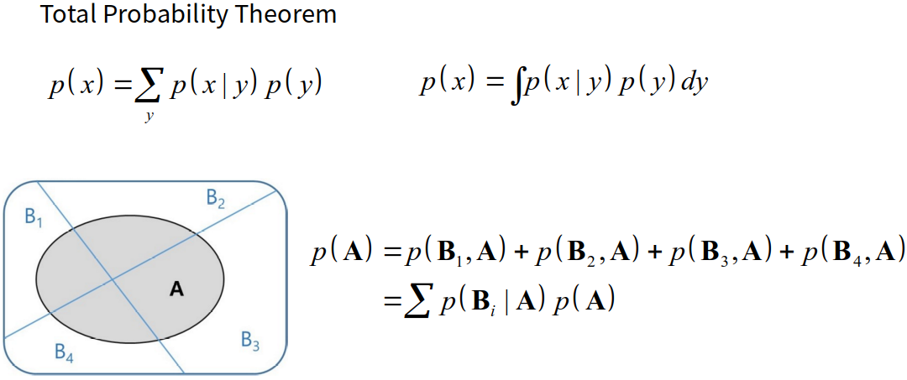
    - Conditional Probability (Likelihood)
        - 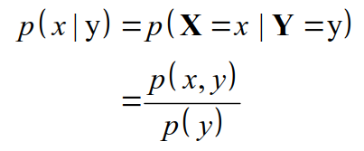
    - Bayes Rule
        - 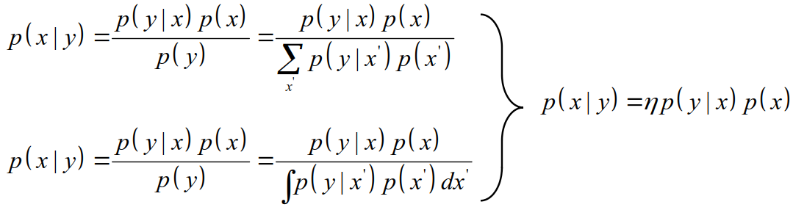

2. Bayes Filter (수식 매우 중요)
    - Bayes Rule에 `Marcov Process` + `Recursive` 을 부여하여 `Belief`를 Recursively Update!
    - 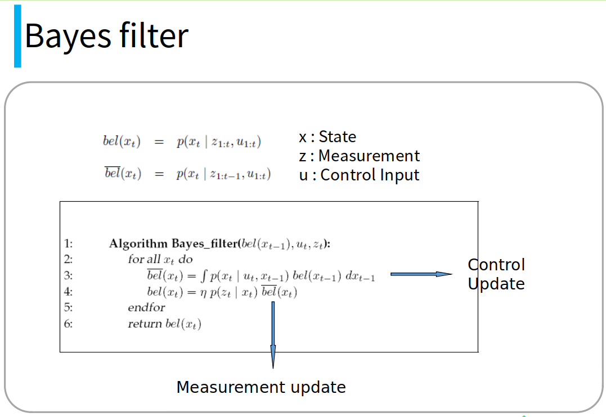
    - 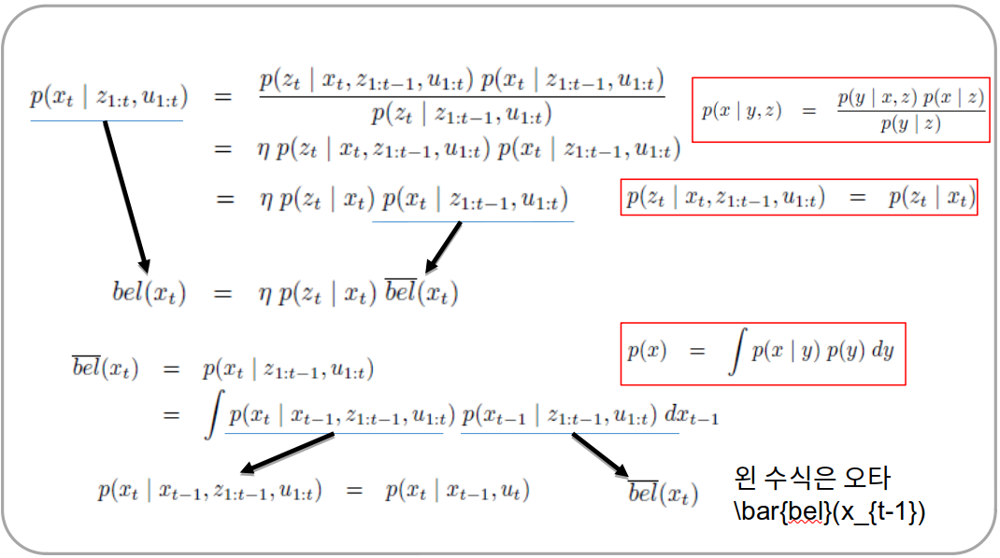

3. Lecture Practice
    - [robotBayesNoInput.cpp](./2_lecturePractice/1_bayesFilter/robotBayesNoInput.cpp)
    - [robotBayesWithInput.cpp](./2_lecturePractice/1_bayesFilter/robotBayesWithInput.cpp)

4. Naive Bayes Filter Review
    - 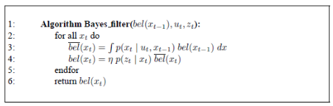
    1. 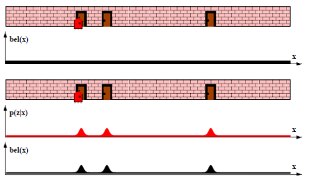
    2. 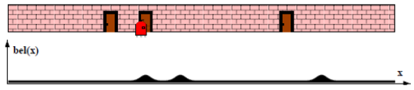
    3. 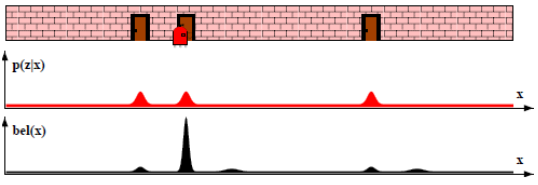
    4. 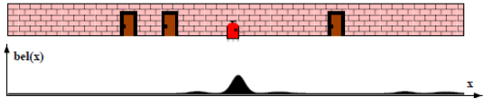

## Day2, Kalman
- Bayes 필터는, 모든 state에 대한 확률 적분값(Total Probability Theorem)을 구하는 것이 현실적으로 불가능하다.
- 이를 실현 가능한 표현형으로 풀어낸 것이 칼만필터이다. 바로 가우시안 확률분포를 활용하여서..,
- 모델의 분산과, 센서값의 분산, 이 둘을 이용해서 new_X를 만들어 내는 과정이 칼만필터
    - 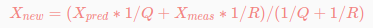

1. Derivation
- Assumption: Linear Model, Noise is follow Gaussian
    - Linear여야지만, 칼만 필터의 Equation을 유도할 수 있고 (예를 들어, `A'PA+Q`) 가우시안 이여야지만 확률분포를 임의의 함수가 아닌, 평균과 분산으로만 기술할 수 있게 된다.
- 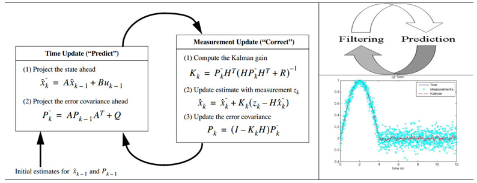
- 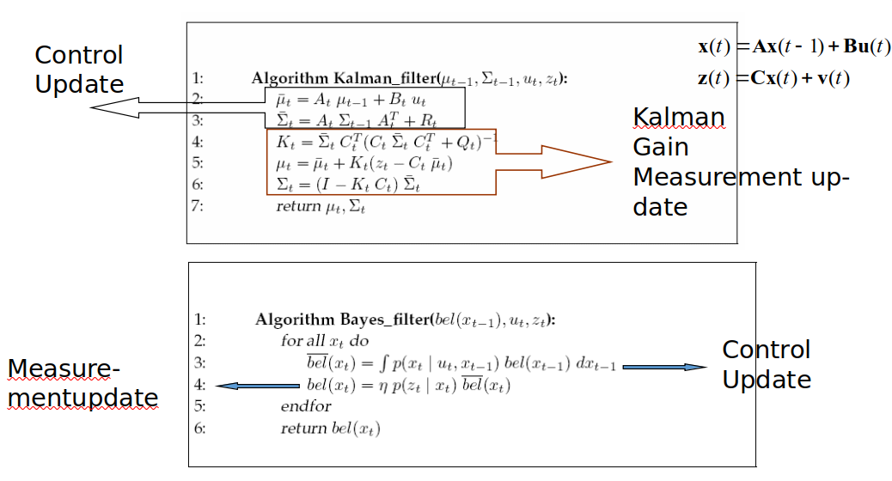
- 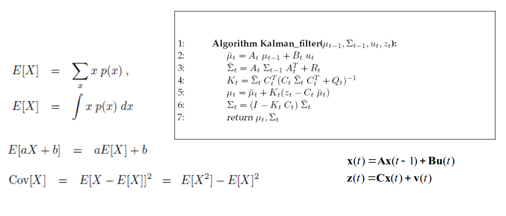
- 자료에 오타가 있는데, 한번 정리한 후에 올려야할 듯

2. Lecture Practice
    - [kalmanLinearX.cpp](./2_lecturePractice/2_kalmanFilter/kalmanLinearX.cpp)
    - [kalmanLinearXY.cpp](./2_lecturePractice/2_kalmanFilter/kalmanLinearXY.cpp)

3. Extended Kalman Filter
    - 선형화(Jacobian)을 통한 [Covariance, State] Linear Expansion
    - 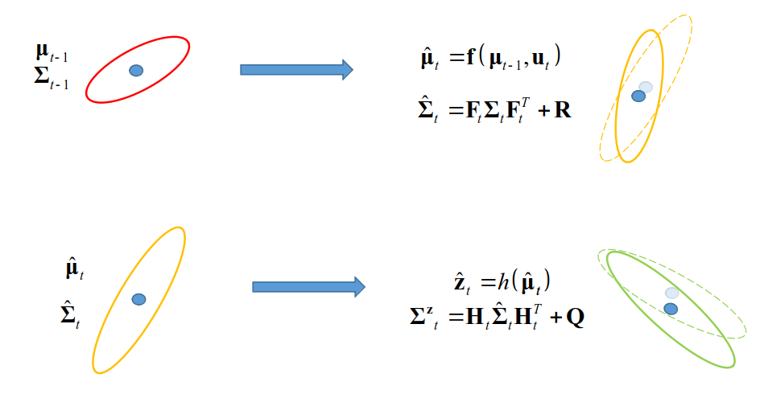
    - 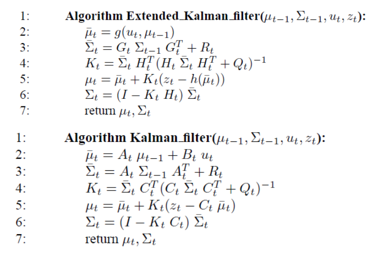
    - 

## Day3, Nonlinear Kalman

1. Lecture Practice(EFK)
    - [extendedKalmanRadar.cpp](./2_lecturePractice/3_extendedKalmanFilter/extendedKalmanRadar.cpp)
    - [extendedKalmanBenchmark.cpp](./2_lecturePractice/3_extendedKalmanFilter/extendedKalmanBenchmark.cpp)

2. Unscented Kalman Filter
    - 비선형성이 크면 클수록, EKF의 성능은 저하된다.
    - `Sigma Points`인 (1+2N)개 포인트 만으로도 로 가우시안을 평가할 수 있다. `Unscented Transform`
        - N은 State의 개수를 의미함
        - 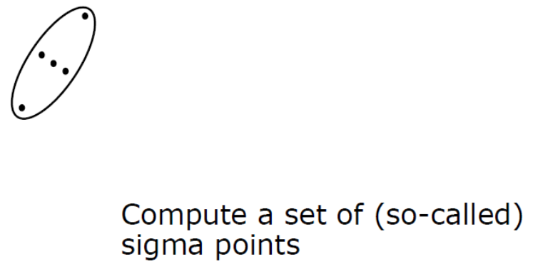
    - 점들은 어떻게 고를까?
        - Unscented Transform 에 정의대로 1+2N개를 고른다.
        - 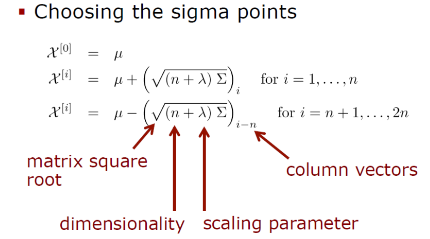
    - 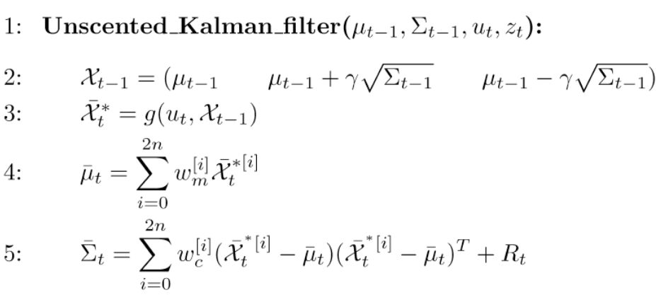
    - 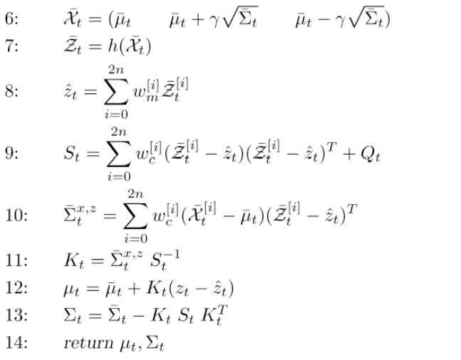

3. 비선형 칼만 한계
    - 가우시안 노이즈를 따르지 않는 문제에서, 어떻게든 선형화(Extended), 선형평가(Unscented) 방식으로는 필터의 성능은 나오지 않는다.
    - 비선형을 무조건 선형화(Relaxation)할 수 있는 것이 아니다.
    - 베이즈 필터는 적분에 한계가 있었기 때문에.., 가우시안 분포를 가져와 칼만필터를 만든 것
        - 칼만필터: `Parameteric Approach`: N(0, Sigma^2)
    - 다른식의 접근법: `Non Parameteric Approach`: 가우시안 함수 등을 사용하지 말고 적분해야 하는 샘플의 개수를 유한개(몬테카를로 deploy)로 하여 적분값을 평가하자
        - 파티클필터

4. Particle Filter
r
